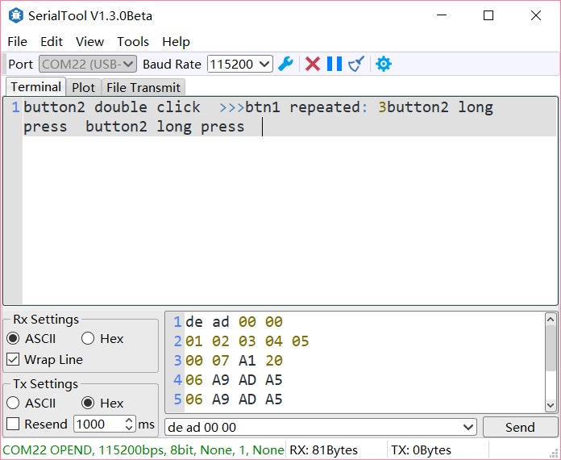
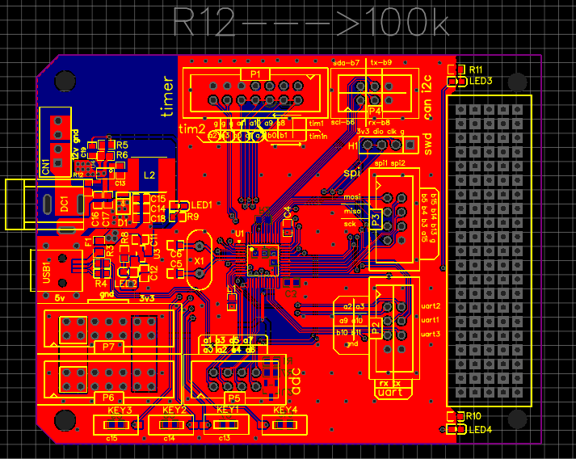

# MultiButton修改版

## 简介
MultiButton 是一个小巧简单易用的事件驱动型按键驱动模块，可无限量扩展按键，按键事件的回调异步处理方式可以简化你的程序结构，去除冗余的按键处理硬编码，让你的按键业务逻辑更清晰。

修改内容：

- 新增全局回调函数
- 添加语法糖
- 实现连续按键后触发连按事件
- 新增keil5工程

## 使用方法
1.先申请一个按键结构

```c
New_Button(btn1, 1); // btn1 是名字，1是编号
/* 宏实现 #define New_Button(__name__, __id__) Button __name__ = {__id__} */
/*此时就有了一个名字叫 btn1 的全局变量 */
```
2.新增两个全局回调函数，请用户自己实现这两个函数，定义函数时一定要把 __weak 去掉啊！

```c
/**
  * @brief  Global Event CallBack func
  * @param  button id & event id
  * @retval None
  */
__weak void Multi_Button_Event_Callback(Button* handle)
{
	// do your own business
}

/**
  * @brief  Global Read CallBack func
  * @param  button id
  * @retval button level
  */
__weak uint8_t Multi_Button_Read_Callback(Button* handle)
{
	// do your own business
	return 1; // !active_level
}
```
3.初始化并启动按键对象，后一个参数设置有效触发电平

```
button_start_and_start(&button1, 0);
```
4.设置一个5ms间隔的定时器循环调用后台处理函数

```
while(1) {
    ...
    if(timer_ticks == 5) {
        timer_ticks = 0;
        
        button_ticks();
    }
}
```

## 特性

MultiButton 使用C语言实现，基于面向对象方式设计思路，每个按键对象单独用一份数据结构管理：

```c
struct Button {
    uint8_t id;
	uint16_t ticks;
	uint8_t  repeat: 4;
	uint8_t  event : 4;
	uint8_t  state : 3;
	uint8_t  debounce_cnt : 3; 
	uint8_t  active_level : 1;
	uint8_t  button_level : 1;
	// uint8_t  (*hal_button_Level)(void);
	// BtnCallback  cb[number_of_event];
	struct Button* next;
};
```
这样每个按键使用单向链表相连，依次进入 button_handler(struct Button* handle) 状态机处理，所以每个按键的状态彼此独立。


## 按键事件

事件 | 说明
---|---
PRESS_DOWN | 按键按下，每次按下都触发
PRESS_UP | 按键弹起，每次松开都触发
PRESS_REPEAT | 重复按下触发，变量repeat计数连击次数
SINGLE_CLICK | 单击按键事件
DOUBLE_CLICK | 双击按键事件
LONG_RRESS_START | 达到长按时间阈值时触发一次
LONG_PRESS_HOLD | 长按期间一直触发


## Examples

```c
#include "multi_button.h"
#include "stm32f1xx_hal.h"
#include "main.h"

New_Button(btn1, 1); // btn1 是名字，1是编号
New_Button(btn2, 2);

int _main()
{
	... // 初始化代码，省略
	button_init_and_start(&btn1, 0);
	button_init_and_start(&btn2, 0);
	HAL_TIM_Base_Start_IT(&htim4);

	//make the timer invoking the button_ticks() interval 5ms.
	//This function is implemented by yourself.
	__timer_start(button_ticks, 0, 5); // 在5ms中断里面调用button_ticks()
	
	while(1) 
	{}
}

// IO电平读取回调函数
/**
  * @brief  Global Read CallBack func
  * @param  button id
  * @retval button level
  */
uint8_t Multi_Button_Read_Callback(Button* handle)
{
	switch(handle->id)
	{
		case 1:
			return HAL_GPIO_ReadPin(KEY1_GPIO_Port, KEY1_Pin);
		case 2:
			return HAL_GPIO_ReadPin(KEY1_GPIO_Port, KEY2_Pin);
    default:
      return 1; //off
	}
}
// 事件处理回调函数
/**
  * @brief  Global Event CallBack func
  * @param  button id & event id
  * @retval None
  */
void Multi_Button_Event_Callback(Button* handle)
{
	// do your own business
	switch(handle->event)
	{
		case PRESS_DOWN:
		{}break;
		case PRESS_UP:
    	{}break;
		case PRESS_REPEAT:
    	{
			switch(handle->id)
			{
				case 1:
				nrf_send(">>>btn1 repeated: ", 18);
				uint8_t i = handle->repeat + 0x30;
				nrf_send(&i, 1);
			led_ctrl(1, 1);
				break;
				case 2:
				nrf_send(">>>btn2 repeated: ", 18);
				uint8_t j = handle->repeat + 0x30;
				nrf_send(&j, 1);
				led_ctrl(2, 1);
				break;
			}

    	}break;
		case SINGLE_CLICK:
    	{
			switch(handle->id)
			{
				case 1:
				nrf_send("button1 single click  ", 22);
				led_ctrl(1, 0);
				break;
				case 2:
				nrf_send("button2 single click  ", 22);
				led_ctrl(2, 0);
				break;
			}
		}break;
		case DOUBLE_CLICK:
    	{
			switch(handle->id)
			{
				case 1:
				nrf_send("button1 double click  ", 22);
				led_ctrl(1, 1);
				break;
				case 2:
				nrf_send("button2 double click  ", 22);
				led_ctrl(2, 1);
				break;
			}
    	}break;
		case LONG_PRESS_HOLD:
    	{}break;
		case LONG_RRESS_START:
    	{
			switch(handle->id)
			{
				case 1:
				nrf_send("button1 long press  ", 20);
				led_blink(1);
				break;
				case 2:
				nrf_send("button2 long press  ", 20);
				led_blink(2);
				break;
			}
    	}break;
		default:
			break;
	}
}
```

## 工程截图

数据采用nrf24l01传回



测试用电路板如下，PCB工程[请戳我](https://lceda.cn/akua/stm32f103c8t6-board)

